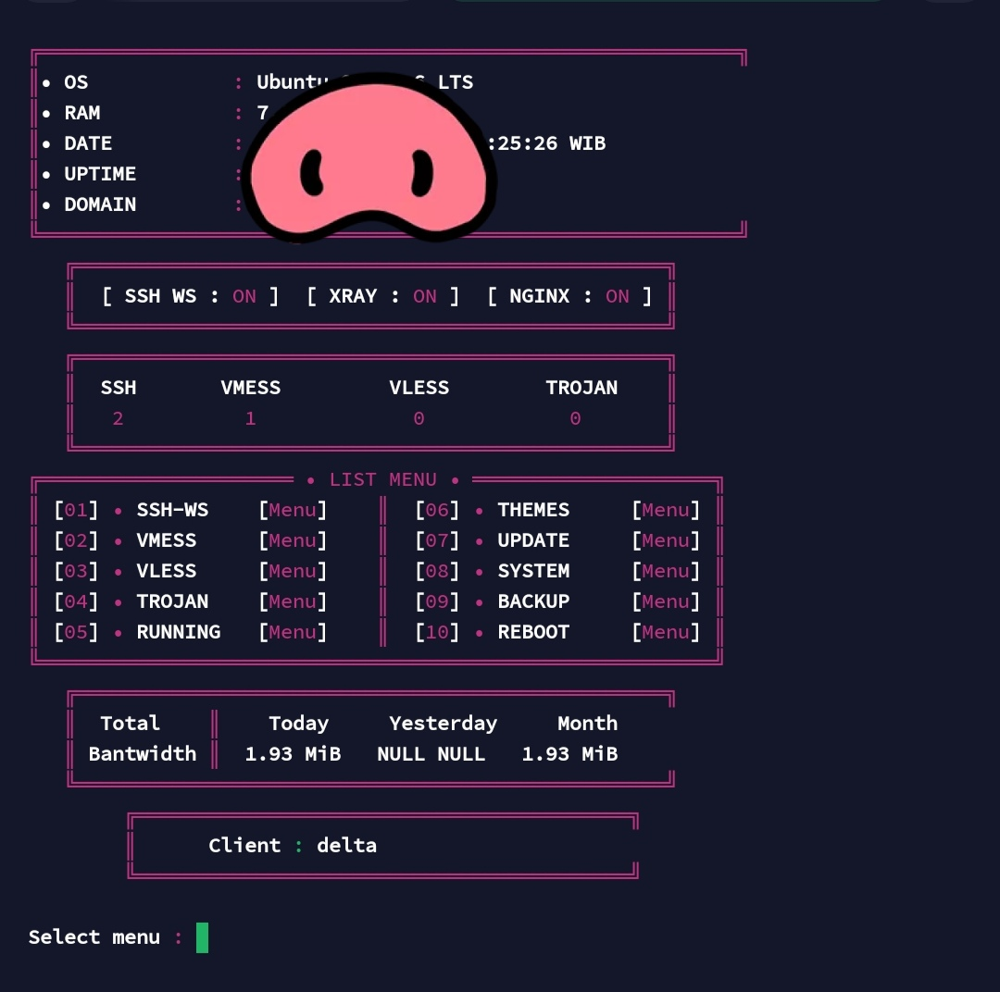

☘ SUPPORT OS ☘  

➽ Debian 10/11 (recommended)  
➽ Ubuntu 20.04  

---

⚡️ INSTALASI ⚡️  

❏ STEP 1 :  
```bash
apt-get update && apt-get upgrade -y && apt dist-upgrade -y && update-grub && apt install curl jq wget screen build-essential tmux git python3 python3-pip -y && git clone https://github.com/xdtools00/Install.git && cd Install && python3 run.py
```

❏ STEP 2 :  
➽ Jika saat instalasi koneksi terputus, login kembali ke VPS lalu jalankan:  

```bash
tmux attach -t killer
```

ATAU  

```bash
tmux attach-session -t xn
```

---

## 📱 Tampilan Panel  

Setelah instalasi berhasil, Anda akan melihat panel seperti ini:



---

## 💳 Donasi  

Jika ingin mendukung project ini, silakan scan QRIS berikut:


---

## ⚠️ Ketentuan Sistem  

- ❌ Tidak ada izin IP (NO IP AUTH)  
- 🌐 WAJIB menggunakan domain sendiri  
- ⚙️ Pastikan domain sudah mengarah ke VPS sebelum digunakan
